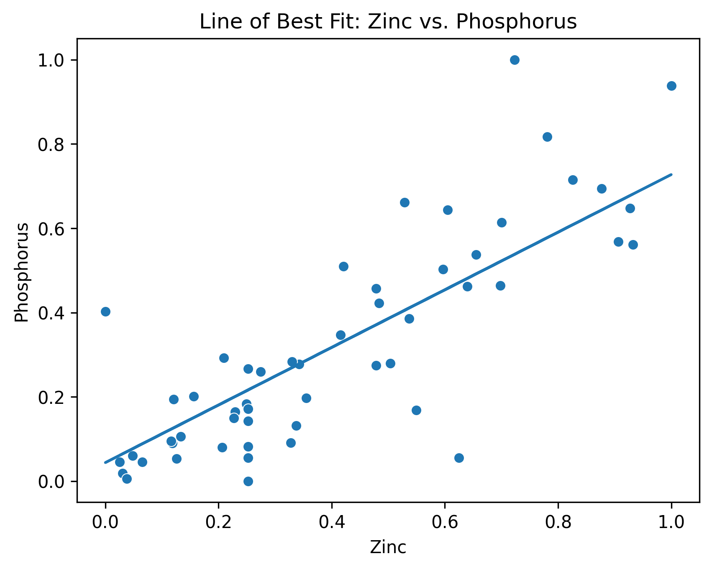
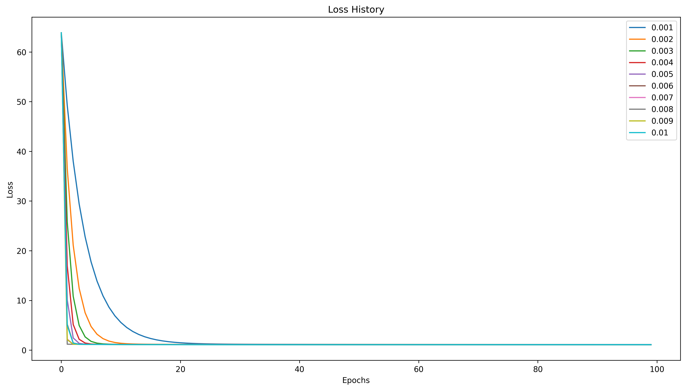

# Gradient Descent from Scratch

In this project, I implemented the **Gradient Descent** algorithm from scratch using Python and NumPy. The goal was to understand how optimization works at a mathematical and code level by manually building each step of the learning loop.

---

## What I Built

I broke the Gradient Descent process into key components and implemented:

- **Hypothesis function** – calculates predictions from model parameters
- **Loss function (MSE)** – evaluates model error
- **Gradient computation** – calculates how the loss changes with respect to parameters
- **Learning rate scaling** – controls update magnitude
- **Parameter update** – applies gradient to reduce loss over time

Each component was validated and combined into a loop simulating one or more epochs of training.

---

## Visualizations & Interpretation

### 🔹 Line of Best Fit (Over Time)

This plot shows how the model learns to fit a line to the data as Gradient Descent progresses. In early iterations, the line poorly approximates the trend, but with more updates, it converges toward the optimal slope and intercept that minimize the loss.

---

### 🔹 Loss vs. Epochs

This chart shows the **loss function value decreasing over time**, confirming that the model is learning. The curve follows a typical exponential decay, indicating successful convergence. Plateaus or increases here would suggest issues with learning rate or gradient computation.

---

## Key Takeaways

- Implementing Gradient Descent manually provides strong intuition for how models learn
- Loss reduction is a useful proxy for training progress and debugging
- Visualization is critical when validating that the model is improving

---

## 📁 Project Files

- `gradient-descent.ipynb` – Main notebook containing implementation, training loop, and plots
- `images/line_of_best_fit.png` – Visualization of model predictions improving over time
- `images/loss_function_of_epochs.png` – Loss curve over training iterations

---

## Tech Stack

- Python  
- NumPy  
- Matplotlib  
- Jupyter Notebook  

---

## Next Steps

- Extend the implementation to multivariate linear regression
- Compare Batch, Stochastic, and Mini-Batch Gradient Descent
- Apply to logistic regression and non-linear cost functions

---

This project helped me reinforce fundamental machine learning principles by building everything from the ground up — no frameworks, just math and code.
